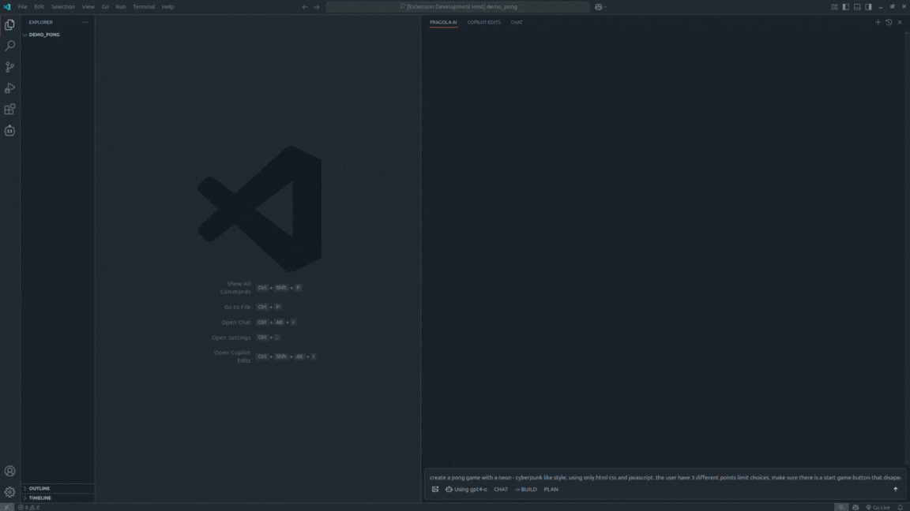

# FragolaAI (Discontinued)

FragolaAI was an open-source coding assistant designed to help developers with code generation, refactoring, and project planning. It leveraged AI capabilities to provide intelligent coding assistance directly within Visual Studio Code.

## Demo: build feature

Here's a demonstration of the build feature, where FragolaAI generates a complete Pong game implementation:

## ⚠️ Project Status: Discontinued

This project is no longer actively maintained. Feel free to fork and modify according to your needs.

## Features

- **AI-Powered Code Generation**: Generate code based on natural language descriptions
- **Project Planning**: Break down complex tasks into manageable subtasks. Then generate the required code with 1 click

## Technical Stack

### Backend
- Node.js
- TypeScript
- OpenAI SDK
- VSCode Extension API
### Frontend
- Svelte 5
- Melt UI
- SCSS

## License

MIT License - Feel free to use the code as reference for your own projects.