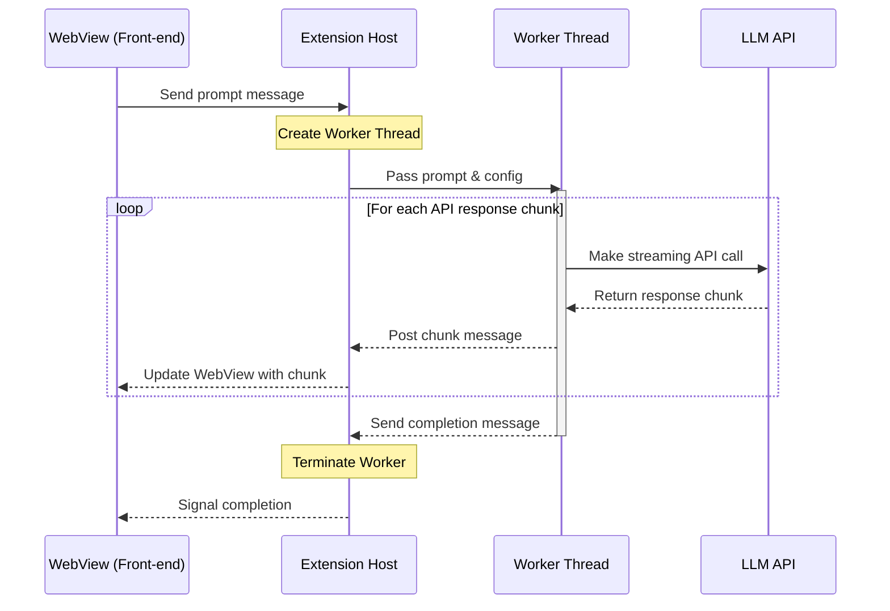

```mermaid
sequenceDiagram
    participant W as WebView (Front-end)
    participant E as Extension Host
    participant WT as Worker Thread
    participant API as LLM API

    W->>E: Send prompt message
    Note over E: Create Worker Thread
    E->>WT: Pass prompt & config
    activate WT
    
    loop For each API response chunk
        WT->>API: Make streaming API call
        API-->>WT: Return response chunk
        WT-->>E: Post chunk message
        E-->>W: Update WebView with chunk
    end
    
    WT-->>E: Send completion message
    deactivate WT
    Note over E: Terminate Worker
    E-->>W: Signal completion
```
